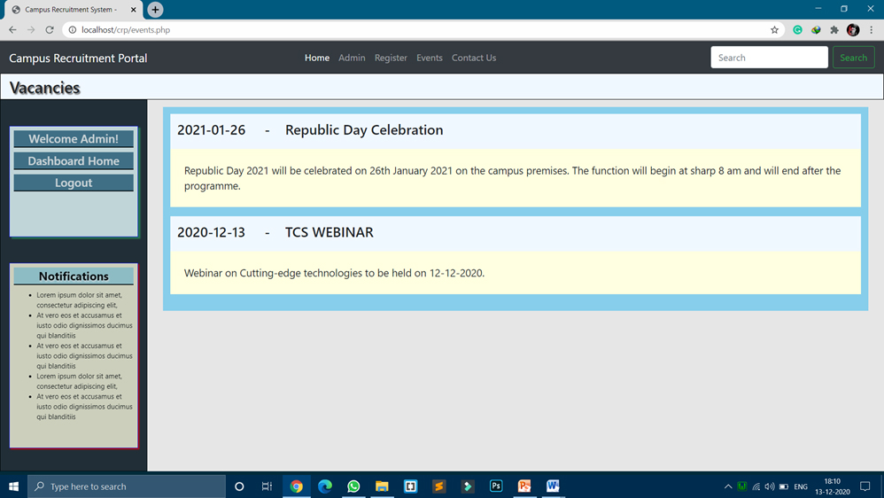

# Campus-Recruitment-Portal 
  
   
   ### The Campus Recruitment Portal is the semester project made in my 3rd Semester of B.Tech.
   
 > **The Campus Recruitment Portal made by me using Php, MYSQL and bootstrap tested on WAMP stack fulfils the purpose of managing files having data from the students and recruiters making the recruitment process handy by providing features to post job ads and accept enrolments for the offer.**

### Preview:

  
 
   
 
   
 
   
 
   
 
   
 
   
 
   
 
   
 
 

### **_Contribute To Make It Better!_**
### **THANK YOU 😎**
